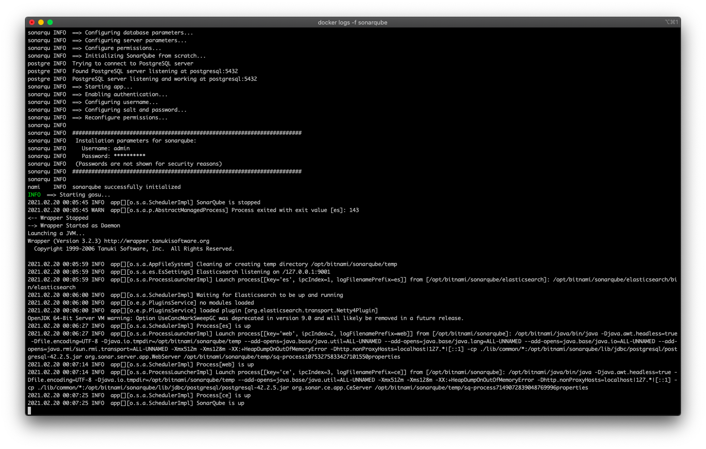
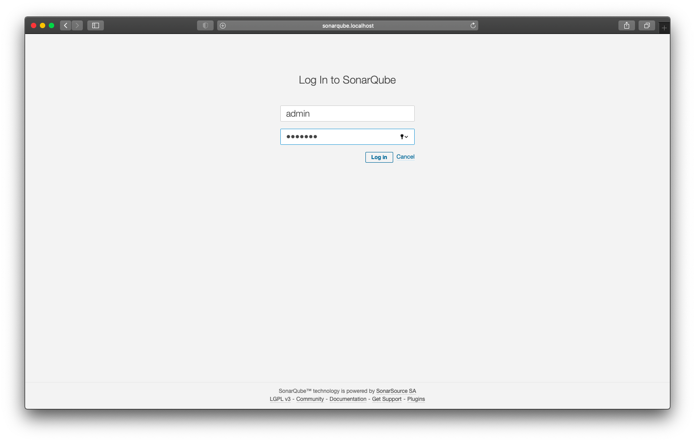
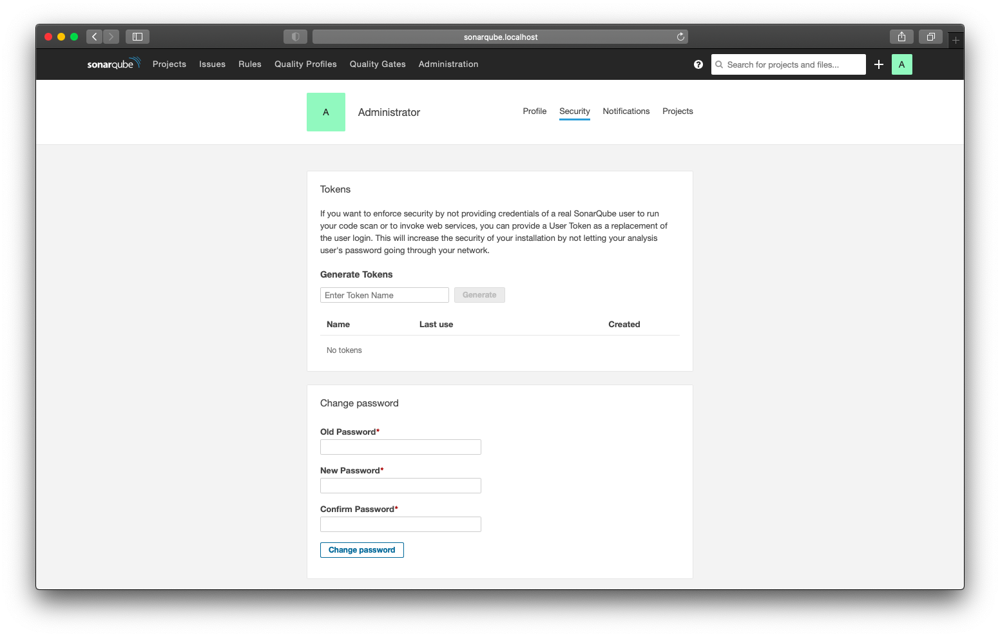
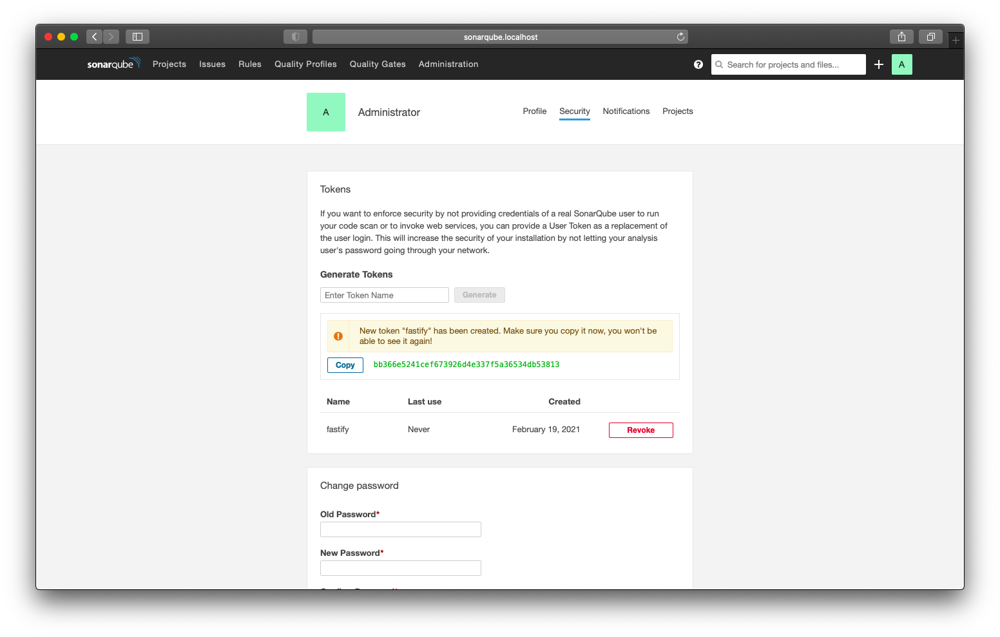
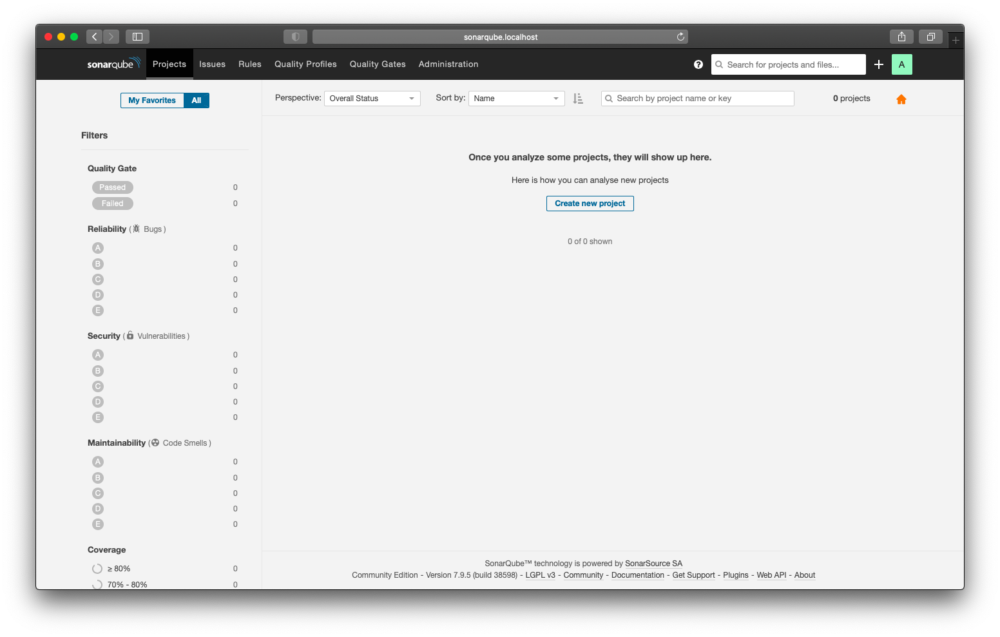
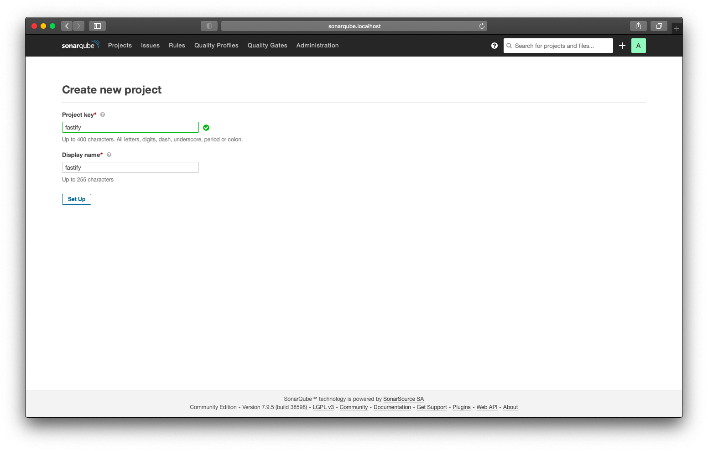
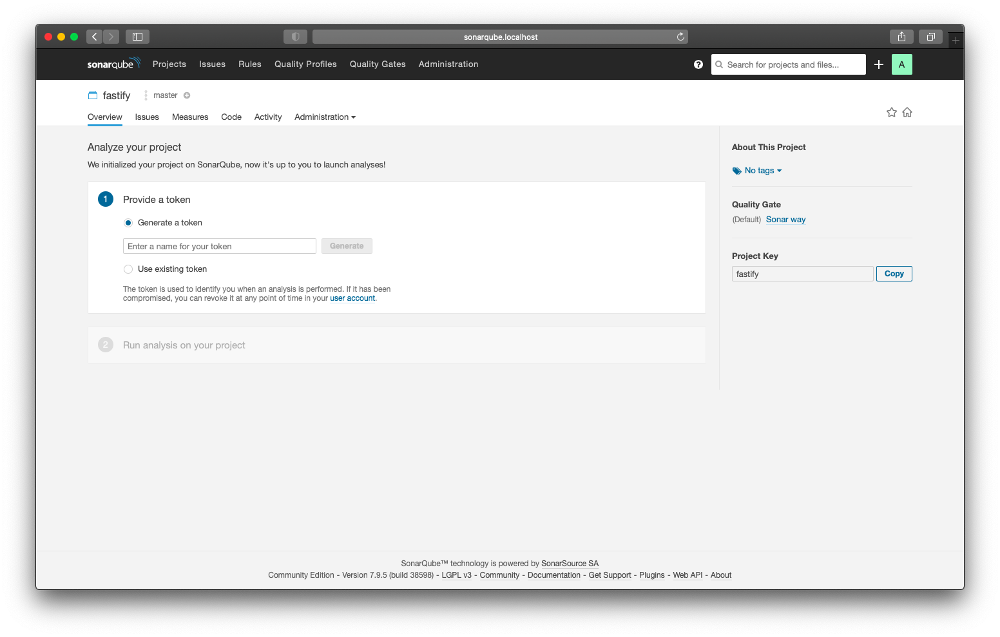
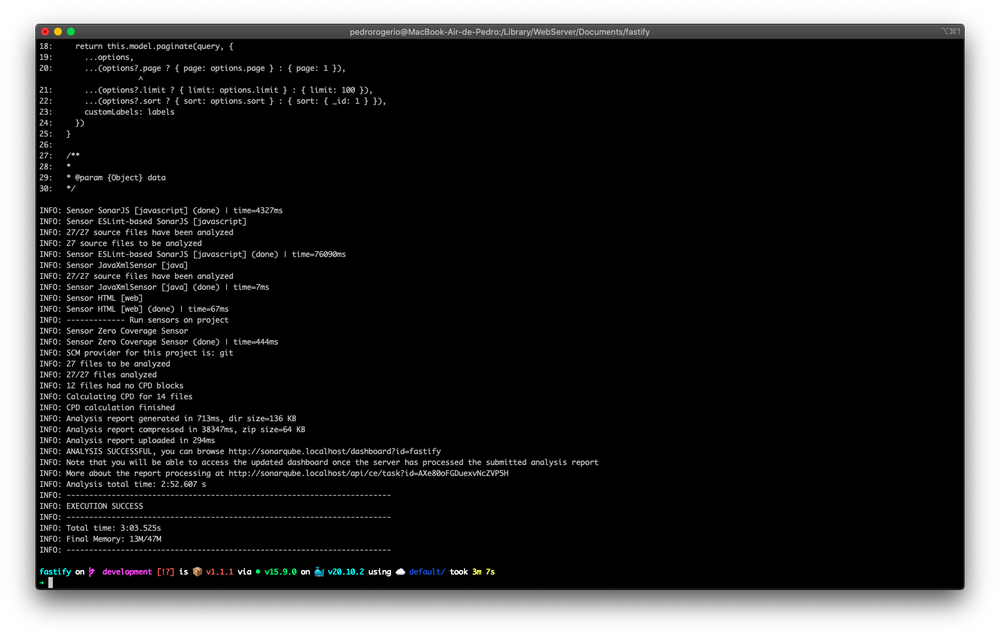
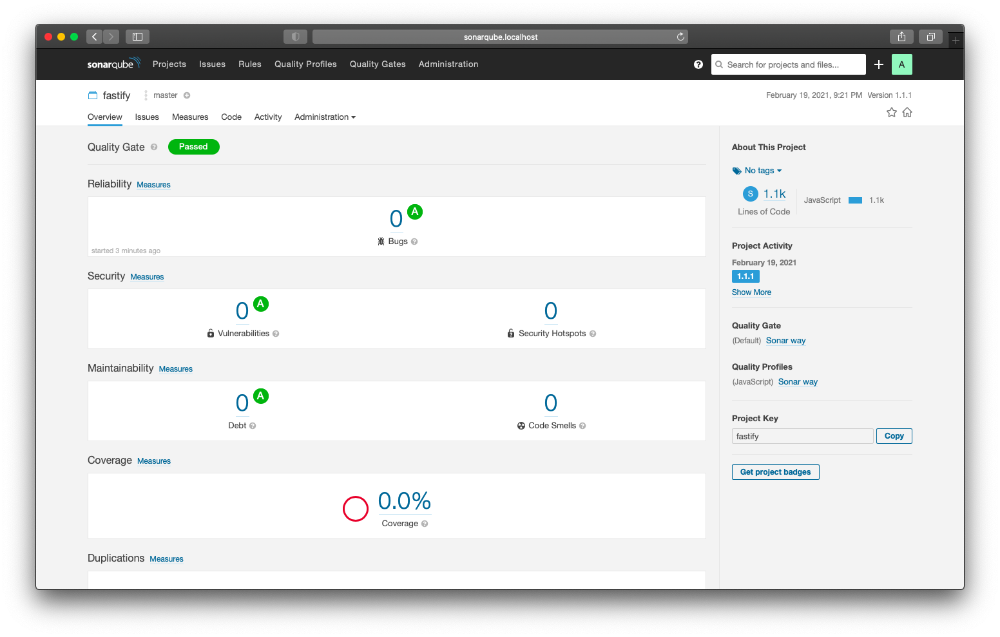

# How to configure Sonarqube

SonarQube is an open-source platform developed by SonarSource for continuous inspection of code quality to perform automatic reviews with static analysis of code to detect bugs, code smells, and security vulnerabilities on 20+ programming languages.

After raising the containers, the sonar will automatically configure itself. This step is only performed once and can take a few minutes and you can follow the logs by executing the following command in the terminal:

```sh
docker logs -f sonarqube
```



When the configuration is finished, just access the url in your browser:

```sh
http://sonarqube.localhost
```

In this first access the login and password are as follows:

```sh
Username: admin
Password: bitnami
```



To change your password just access your account:



This is where you can also create tokens to run sonar-scanner-cli:



Now go to the projects tab and let's configure the first project. Click the button: Create new project:



Add your project name. It must be the same value as sonar.projectKey that is in the [sonar-project.properties](sonar-project.properties) file:



Now you must add a token to your project, if you have already created a token, just now add it here:



With everything set up we will run the project analysis. Copy the token that was generated and execute the following command in a terminal tab:

```sh
docker run \
  --rm \
  --network=host \
  -e SONAR_HOST_URL="http://sonarqube.localhost" \
  -e SONAR_LOGIN="YOUR_TOKEN_HERE" \
  -v "${PWD}:/usr/src" \
  sonarsource/sonar-scanner-cli
```

Note that YOUR_TOKEN_HERE must be your token. During the project analysis you will see something like:



After finishing, just access your project and view the report in the overview tab:


